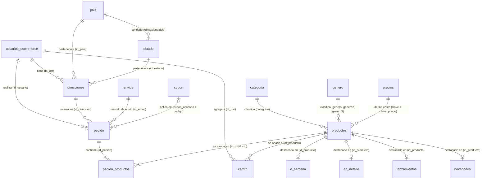

# Auditoría Técnica y Plan de Modernización — Fonarte Latino
### `www.fonartelatino.com` · Stack PHP/MySQL/jQuery/Bootstrap · DreamHost

---

## PARTE 1: DIAGNÓSTICO DEL ESTADO ACTUAL

### 1.1 · Arquitectura General y Versión de PHP

**Estructura: Monolito Spaghetti puro (sin separación de capas)**

El proyecto NO implementa ningún patrón arquitectónico (MVC, Repository, etc.). Cada archivo PHP mezcla en el mismo scope:
- Lógica de negocio (cálculos, validaciones)
- Acceso a base de datos (queries directos con `mysqli_query`)
- Generación de HTML (output)
- Lógica de redirección (`window.location` via JS inline)

**Evidencias directas del escaneo:**

| Síntoma | Archivo(s) | Línea(s) |
|---|---|---|
| Función `GetSQLValueString` duplicada en ≥10 archivos | `index.php`, `carrito.php`, `producto_detalle.php`, `pago.php`, `admin_ver_producto.php`… | L3-32 de cada uno |
| Código de conexión con credenciales en texto plano (local + producción) | `Connections/conexion.php` | L7-40 |
| Contraseñas hardcodeadas en comentarios activos | `Connections/conexion.php` | L23 (`NZojmHb8QyBJf1nk`) |
| Archivo `pass .txt` en raíz del proyecto | `/pass .txt` | — |
| PHP version check para PHP < 6 (código zombi de 2010) | Múltiples | `if (PHP_VERSION < 6)` |
| `mysql_free_result()` llamado al final de `index.php` | `index.php` | L606 |
| Redirecciones vía `<script>window.location=…</script>` en lugar de `header()` | `carrito.php`, `pago.php`, `admin_ver_producto.php` | múltiples |

**Versión de PHP estimada:** El código fue originalmente escrito para PHP 5.x (vestigios de `mysql_pconnect`, `mysql_real_escape_string`, `get_magic_quotes_gpc`). Actualmente usa la API `mysqli_*` que es compatible desde PHP 5.3+. XAMPP local y DreamHost típicamente ejecutan PHP 7.4–8.2. Se recomienda ejecutar `version.php` en el servidor para confirmar.

> [!WARNING]
> La función `utf8_decode()` / `utf8_encode()` está **deprecada desde PHP 8.2** y será eliminada en PHP 9. Se usa extensivamente en casi TODOS los archivos para mostrar texto (artista, álbum, descripción). Esto es una **bomba de tiempo** que romperá el sitio en un upgrade de servidor.

---

### 1.2 · Gestión de Conexiones a MySQL

**Método actual:** `mysqli_*` procesal (no PDO). Sin prepared statements.

```php
// Patrón actual — VULNERABLE A SQL INJECTION
$query = "SELECT * FROM productos WHERE id=" . $_GET['id_producto'];
$result = mysqli_query($conexion, $query) or die(mysqli_error($conexion));
```

**Hallazgos críticos de seguridad:**

| Vulnerabilidad | Archivo | Línea |
|---|---|---|
| `$_GET['id_producto']` directamente en query SQL | `producto_detalle.php` | L42, L83 |
| `$_SESSION['PEDIDO_NUEVO']` directamente en query SQL | `pago.php` | L67, L76 |
| `$_GET['id']` directamente en DELETE query | `carrito.php` | L110-111 |
| `$_POST['cupon']` directamente en query (sin escape) | `pago.php` | L115, L128 |
| Autenticación admin sin validación de rol explícita en todos los endpoints | `admin_ver_producto.php` | L44 |
| `die(mysqli_error($conexion))` expone estructura DB en producción | Todos los archivos | — |

**Sin tokens CSRF** en ningún formulario POST del sitio (carrito, checkout, formularios de admin).

**`GetSQLValueString`**: Esta función custom realiza un tipo de "escape por tipo" pero la versión en `analytic.php` llama a `mysql_real_escape_string()` (API eliminada en PHP 7), mientras en otros archivos esa línea está comentada, dejando las cadenas sin escape.

---

### 1.3 · Análisis del CSS

**Hojas de estilo cargadas por página:**

| Archivo | Tamaño | Naturaleza |
|---|---|---|
| `css/bootstrap.min.css` | **152 KB** | Bootstrap 3.x completo |
| `css/modern-business.css` | 1.5 KB | Mínima personalización |
| `css/style.css` | **41 KB** | CSS custom (2,241 líneas) |
| `css/estiloFirelink1.css` | **63 KB** | Estilos del módulo Firelink |
| `css/estiloFirelink3.css` | **49 KB** | Otro conjunto Firelink |
| `css/tarjeta.css` | 5.5 KB | Estilos de tarjeta |

**Problemas identificados:**

- **Bootstrap 3** (lanzado 2013) con compatibilidad IE8 via `html5shiv` y `respond.js`. Peso total de CSS: ~315 KB sin comprimir por petición inicial.
- **Sin variables CSS** (`--color-primary: #244e58`). Los colores corporativos (`#244e58`, `#FDBE33`) están hardcodeados en decenas de reglas dispersas en `style.css`.
- **Estilos inline masivos:** En `index.php`, `carrito.php`, `pago.php` y `producto_detalle.php` abundan `style="..."` directos en el HTML con valores de dimensiones, colores y margins. Esto hace imposible tematizar sin editar todos los archivos.
- **CSS duplicado:** `estiloFirelink1.css` y `estiloFirelink3.css` contienen bloques de reglas prácticamente idénticos para `.navbar`, `.carousel`, `.footer`.
- **Sin metodología de nomenclatura**: Clases como `tipografia2`, `tipografia_admin_ver_prod`, `franja`, `carrusel_index` sin patrón BEM ni otro estándar.
- **Sin media queries consistentes** para responsividad más allá de las de Bootstrap 3.

---

### 1.4 · jQuery y JavaScript

**Versión de jQuery:** `jquery.js` presente en la raíz (91 KB) y en `/js/jquery.js` (95 KB). **Dos copias de jQuery** en el proyecto. La versión no se identificó por nombre de archivo pero el tamaño sugiere jQuery 1.11.x (2014).

**Patrón de uso de JS:**

- jQuery cargado al **final del body** (correcto) pero sin `defer` ni módulos ES6.
- Archivos `js_*.php` que generan JavaScript dinámico desde PHP (ej: `js_aplica_cupon.php`, `js_estados.php`). Anti-patrón: mezcla lógica de servidor con salida JS.
- **Sin `fetch()` ni XMLHttpRequest moderno**: Las interacciones asíncronas se realizan mediante redirección a `window.location` (recarga completa de página). No hay AJAX real implementado de forma consistente.
- Archivos JS con validaciones de formulario usando `jqBootstrapValidation.js` (plugin desactualizado, 37 KB).
- `funciones.js` en raíz tiene solo **516 bytes** → archivo vacío/huérfano.

---

### 1.5 · Estructura de Tablas MySQL (detallada desde fonartecommerce.sql)

A continuación se detalla la estructura real de la base de datos extraída del script:

#### Tabla: `carrito`

| Columna | Tipo | Detalles |
|---------|------|----------|
| `id` | `int` | NOT NULL |
| `id_usr` | `int` | NOT NULL |
| `id_producto` | `int` | NOT NULL |
| `id_producto_fonarte` | `text` | CHARACTER SET utf8 COLLATE utf8_unicode_ci |
| `tipo` | `text` | CHARACTER SET utf8 COLLATE utf8_unicode_ci |
| `artista` | `text` | CHARACTER SET utf8 COLLATE utf8_unicode_ci |
| `album` | `text` | CHARACTER SET utf8 COLLATE utf8_unicode_ci |
| `precio` | `int` | DEFAULT NULL |
| `cantidad` | `int` | NOT NULL |
| `fecha` | `date` | NOT NULL |
| `hora` | `time` | NOT NULL |

#### Tabla: `categoria`

| Columna | Tipo | Detalles |
|---------|------|----------|
| `id` | `int` | NOT NULL |
| `nombre` | `text` | NOT NULL |
| `estatus` | `int` | NOT NULL |

#### Tabla: `cat_otros`

| Columna | Tipo | Detalles |
|---------|------|----------|
| `id` | `int` | NOT NULL |
| `nombre` | `text` | NOT NULL |
| `estatus` | `int` | NOT NULL |

#### Tabla: `cat_tallas`

| Columna | Tipo | Detalles |
|---------|------|----------|
| `id` | `int` | NOT NULL |
| `talla` | `varchar(4)` | NOT NULL |
| `estatus` | `int` | NOT NULL |

#### Tabla: `contacto`

| Columna | Tipo | Detalles |
|---------|------|----------|
| `id` | `int` | NOT NULL |
| `nombre` | `text` | NOT NULL |
| `email` | `text` | NOT NULL |
| `telefono` | `text` | NOT NULL |
| `comentario` | `text` | NOT NULL |
| `fecha` | `date` | NOT NULL |
| `hora` | `time` | NOT NULL |

#### Tabla: `cupon`

| Columna | Tipo | Detalles |
|---------|------|----------|
| `id` | `int` | NOT NULL |
| `codigo` | `text` | CHARACTER SET utf8 COLLATE utf8_unicode_ci NOT NULL |
| `medida` | `text` | CHARACTER SET utf8 COLLATE utf8_unicode_ci NOT NULL |
| `descuento` | `int` | NOT NULL |
| `vencimiento` | `date` | NOT NULL |
| `mas_de` | `int` | NOT NULL |
| `fecha_creacion` | `date` | NOT NULL |
| `fecha_uso` | `date` | NOT NULL |
| `usado_por_pedido` | `int` | DEFAULT NULL |
| `estatus` | `text` | CHARACTER SET utf8 COLLATE utf8_unicode_ci NOT NULL |

#### Tabla: `direcciones`

| Columna | Tipo | Detalles |
|---------|------|----------|
| `id` | `int` | NOT NULL |
| `id_usr` | `int` | NOT NULL |
| `calle` | `text` | CHARACTER SET utf8 COLLATE utf8_unicode_ci |
| `colonia` | `text` | CHARACTER SET utf8 COLLATE utf8_unicode_ci |
| `muni_dele` | `text` | CHARACTER SET utf8 COLLATE utf8_unicode_ci |
| `cp` | `text` | CHARACTER SET utf8 COLLATE utf8_unicode_ci |
| `n_ext` | `text` | CHARACTER SET utf8 COLLATE utf8_unicode_ci |
| `n_int` | `text` | CHARACTER SET utf8 COLLATE utf8_unicode_ci |
| `id_pais` | `int` | DEFAULT NULL |
| `pais` | `text` | CHARACTER SET utf8 COLLATE utf8_unicode_ci |
| `id_estado` | `int` | DEFAULT NULL |
| `estado` | `text` | CHARACTER SET utf8 COLLATE utf8_unicode_ci |
| `entre_calle_1` | `text` | CHARACTER SET utf8 COLLATE utf8_unicode_ci |
| `entre_calle_2` | `text` | CHARACTER SET utf8 COLLATE utf8_unicode_ci |
| `nombre_recibe` | `text` | CHARACTER SET utf8 COLLATE utf8_unicode_ci |
| `tel_recibe` | `text` | CHARACTER SET utf8 COLLATE utf8_unicode_ci |
| `estatus` | `int` | NOT NULL |

#### Tabla: `d_semana`

| Columna | Tipo | Detalles |
|---------|------|----------|
| `id` | `int` | NOT NULL |
| `id_producto` | `int` | NOT NULL |

#### Tabla: `envios`

| Columna | Tipo | Detalles |
|---------|------|----------|
| `id` | `int` | NOT NULL |
| `region` | `text` | CHARACTER SET utf8 COLLATE utf8_unicode_ci NOT NULL |
| `precio` | `int` | NOT NULL |
| `descripcion` | `text` | CHARACTER SET utf8 COLLATE utf8_unicode_ci NOT NULL |

#### Tabla: `en_detalle`

| Columna | Tipo | Detalles |
|---------|------|----------|
| `id` | `int` | NOT NULL |
| `id_producto` | `int` | NOT NULL |

#### Tabla: `estado`

| Columna | Tipo | Detalles |
|---------|------|----------|
| `id` | `int` | NOT NULL |
| `ubicacionpaisid` | `int` | NOT NULL |
| `estadonombre` | `text` | CHARACTER SET utf8 COLLATE utf8_unicode_ci NOT NULL |

#### Tabla: `estatus_cupones`

| Columna | Tipo | Detalles |
|---------|------|----------|
| `id` | `int` | NOT NULL |
| `estatus` | `text` | CHARACTER SET utf8 COLLATE utf8_unicode_ci NOT NULL |
| `descripcion` | `text` | CHARACTER SET utf8 COLLATE utf8_unicode_ci NOT NULL |

#### Tabla: `estatus_forma_pago`

| Columna | Tipo | Detalles |
|---------|------|----------|
| `id` | `int` | NOT NULL |
| `estatus` | `int` | NOT NULL |
| `descripcion` | `text` | CHARACTER SET utf8 COLLATE utf8_unicode_ci NOT NULL |

#### Tabla: `genero`

| Columna | Tipo | Detalles |
|---------|------|----------|
| `id` | `int` | NOT NULL |
| `nombre` | `text` | NOT NULL |
| `estatus` | `int` | NOT NULL |

#### Tabla: `lanzamientos`

| Columna | Tipo | Detalles |
|---------|------|----------|
| `id` | `int` | NOT NULL |
| `id_producto` | `int` | NOT NULL |

#### Tabla: `novedades`

| Columna | Tipo | Detalles |
|---------|------|----------|
| `id` | `int` | NOT NULL |
| `id_producto` | `int` | NOT NULL |

#### Tabla: `pais`

| Columna | Tipo | Detalles |
|---------|------|----------|
| `id` | `int` | NOT NULL |
| `paisnombre` | `varchar(250)` | CHARACTER SET utf8 COLLATE utf8_unicode_ci NOT NULL |

#### Tabla: `pedido`

| Columna | Tipo | Detalles |
|---------|------|----------|
| `id` | `int` | NOT NULL |
| `id_usuario` | `int` | NOT NULL |
| `id_direccion` | `int` | NOT NULL |
| `forma_pago` | `text` | CHARACTER SET utf8 COLLATE utf8_unicode_ci NOT NULL |
| `subtotal_productos` | `int` | DEFAULT NULL |
| `id_envio` | `int` | DEFAULT NULL |
| `precio_envio` | `int` | DEFAULT NULL |
| `total` | `int` | DEFAULT NULL |
| `cupon_aplicado` | `text` | CHARACTER SET utf8 COLLATE utf8_unicode_ci |
| `estatus` | `int` | NOT NULL |
| `descripcion_estatus` | `text` | CHARACTER SET utf8 COLLATE utf8_unicode_ci NOT NULL |
| `fecha` | `date` | NOT NULL |
| `hora` | `time` | NOT NULL |

#### Tabla: `pedido_productos`

| Columna | Tipo | Detalles |
|---------|------|----------|
| `id` | `int` | NOT NULL |
| `id_pedido` | `int` | NOT NULL |
| `id_producto` | `int` | NOT NULL |
| `id_producto_fonarte` | `text` | CHARACTER SET utf8 COLLATE utf8_unicode_ci |
| `tipo` | `text` | CHARACTER SET utf8 COLLATE utf8_unicode_ci |
| `artista` | `text` | CHARACTER SET utf8 COLLATE utf8_unicode_ci |
| `album` | `text` | CHARACTER SET utf8 COLLATE utf8_unicode_ci |
| `cantidad` | `int` | NOT NULL |
| `precio` | `int` | NOT NULL |
| `precio_final` | `int` | NOT NULL |
| `fecha_hora` | `date` | NOT NULL |

#### Tabla: `precios`

| Columna | Tipo | Detalles |
|---------|------|----------|
| `id` | `int` | NOT NULL |
| `clave` | `text` | NOT NULL |
| `precio` | `int` | NOT NULL |

#### Tabla: `productos`

| Columna | Tipo | Detalles |
|---------|------|----------|
| `id` | `int` | NOT NULL |
| `sku` | `text` | NOT NULL |
| `id_fonarte` | `text` | NOT NULL |
| `clave_precio` | `text` | NOT NULL |
| `artista` | `text` | NOT NULL |
| `album` | `text` | NOT NULL |
| `genero` | `text` | NOT NULL |
| `genero2` | `text` | NOT NULL |
| `genero3` | `text` | NOT NULL |
| `categoria` | `int` | NOT NULL |
| `play` | `text` |  |
| `spotify` | `text` |  |
| `itunes` | `text` |  |
| `amazon` | `text` |  |
| `google` | `text` |  |
| `amazon_mu` | `text` |  |
| `youtube` | `text` |  |
| `deezer` | `text` |  |
| `tidal` | `text` |  |
| `ruta_img` | `text` |  |
| `ruta_img_2` | `text` |  |
| `video` | `text` |  |
| `descripcion` | `text` |  |
| `fecha_alta` | `date` | NOT NULL |
| `hora_alta` | `time` | NOT NULL |
| `prendido` | `int` | NOT NULL |
| `estatus` | `text` | NOT NULL |
| `firelink` | `text` |  |
| `p` | `text` | CHARACTER SET utf8 COLLATE utf8_general_ci |
| `promo` | `text` | CHARACTER SET utf8 COLLATE utf8_general_ci |

#### Tabla: `productos_otros`

| Columna | Tipo | Detalles |
|---------|------|----------|
| `id` | `int` | NOT NULL |
| `sku` | `text` | NOT NULL |
| `id_fonarte` | `text` | NOT NULL |
| `clave_precio` | `text` | NOT NULL |
| `artista` | `text` | NOT NULL |
| `tipo` | `int` | NOT NULL |
| `s` | `int` | DEFAULT NULL |
| `m` | `int` | DEFAULT NULL |
| `l` | `int` | DEFAULT NULL |
| `ruta_img` | `text` | NOT NULL |
| `ruta_img_2` | `text` | NOT NULL |
| `descripcion` | `text` | NOT NULL |
| `fecha_alta` | `date` | NOT NULL |
| `hora_alta` | `time` | NOT NULL |
| `prendido` | `int` | NOT NULL |
| `estatus` | `text` | NOT NULL |

#### Tabla: `usuarios`

| Columna | Tipo | Detalles |
|---------|------|----------|
| `id` | `int` | NOT NULL |
| `nombre` | `text` | NOT NULL |
| `apepat` | `text` | NOT NULL |
| `apemat` | `text` | NOT NULL |
| `usr` | `text` | NOT NULL |
| `psw` | `text` | NOT NULL |
| `nivel` | `int` | NOT NULL |
| `estatus` | `varchar(1)` | NOT NULL |
| `iframe` | `text` |  |

#### Tabla: `usuarios_ecommerce`

| Columna | Tipo | Detalles |
|---------|------|----------|
| `id` | `int` | NOT NULL |
| `nombre` | `text` | CHARACTER SET utf8 COLLATE utf8_unicode_ci NOT NULL |
| `apepat` | `text` | CHARACTER SET utf8 COLLATE utf8_unicode_ci NOT NULL |
| `apemat` | `text` | CHARACTER SET utf8 COLLATE utf8_unicode_ci NOT NULL |
| `email` | `text` | CHARACTER SET utf8 COLLATE utf8_unicode_ci NOT NULL |
| `psw` | `text` | CHARACTER SET utf8 COLLATE utf8_unicode_ci NOT NULL |
| `fecha_alta` | `datetime` | NOT NULL |
| `estatus` | `int` | NOT NULL |


### 1.5.1 · Mapa de Relaciones (Diagrama Entidad-Relación)

A continuación se presenta un análisis de las relaciones inferidas entre las tablas principales del sistema. Cabe destacar que en MySQL no hay llaves foráneas estrictas definidas en el código SQL (constraints `FOREIGN KEY`), por lo que las relaciones se mantienen a nivel de lógica de aplicación.



#### Observaciones sobre las relaciones:
1. **Pedidos y Usuarios**: Un usuario (`usuarios_ecommerce`) puede tener múltiples `direcciones` y realizar múltiples `pedido`s.
2. **Productos y Catálogos**: La tabla `productos` se nutre de `categoria`, `genero` y `precios`. Sin embargo, los campos en `productos` que apuntan a catálogos suelen ser de tipo `text` en vez de `int`, lo que indica un almacenamiento poco óptimo o histórico.
3. **Carrito y Pedido**: `carrito` funciona de manera transaccional para la sesión actual del usuario, mientras que `pedido_productos` persiste la snapshot del pedido finalizado.
4. **Falta de Integridad Referencial**: Al no usar dependencias (Constraints FK) explícitas en el motor InnoDB, existe riesgo de datos huérfanos (por ejemplo, si se borra un `producto`, puede romperse la relación en `pedido_productos` si no se maneja por código).

> [!NOTE]
> El campo `estatus` en `productos` con valores `ACTIVO` / `INACTIVO` / `DIGITAL` ya implementa parcialmente la lógica Físico vs Digital. Sin embargo, no distingue entre "Solo digital", "Solo físico" y "Ambos formatos", que sería el estado ideal.

---

### 1.6 · Diagnóstico de Infraestructura Pública y Enmascaramiento

**`.htaccess` actual — análisis:**

```apache
# Lo que SÍ existe (bien):
RewriteRule ^producto_detalle/([0-9]+) producto_detalle.php?id_producto=$1
RewriteRule ^firelink/([0-9]+) firelinkPlantilla.php?id=$1
RewriteRule ^panel-admin?$ login.php
RewriteCond %{HTTPS} !=on → redirect a HTTPS (bien)

# Lo que FALTA:
# - Sin slugs para artistas, géneros ni categorías
# - Sin cabeceras de caché (Cache-Control, Expires)
# - Sin compresión Gzip/Brotli habilitada
# - Sin cabeceras de seguridad (X-Frame-Options, CSP, HSTS)
# - Sin bloqueo de acceso a directorios admin desde exterior
```

**URLs actuales expuestas al público:**

| URL visible | Patrón de ruta actual | ¿Enmascara? |
|---|---|---|
| Producto detalle | `/producto_detalle/123/artista-album` | ✅ Parcial |
| Catálogo | `/catalogo.php?categoria=1` | ❌ Expone parámetro |
| Géneros | `/generos.php?genero=15` | ❌ Expone ID |
| Búsqueda | `/busqueda.php?q=...` | ⚠️ Aceptable |
| Panel admin | `/panel-admin` → `login.php` | ✅ Parcial |
| Analytics | `/analytic` → `login.php` (URL descriptiva) | ⚠️ Revela módulo |
| Endpoints AJAX | `/ajax_contenido_*.php` | ❌ Expuestos públicamente |

**SEO y Metadata — carencias identificadas:**

- ❌ **Sin `sitemap.xml`** en el servidor
- ❌ **Sin `robots.txt`** (los directorios admin son rastreables)
- ⚠️ **Meta description** existe en `index.php` pero es estática y no dinámica por artista/álbum
- ❌ **Sin Open Graph tags** (compartir en redes sociales no genera preview de portada)
- ❌ **Sin Twitter Cards**
- ❌ **Sin Schema.org / JSON-LD** para música o producto
- ⚠️ `favicon.gif` y `favicon.ico` en raíz, pero sin `apple-touch-icon` ni favicon SVG
- ✅ Existe `googleb52e434f43c94bcd.html` → Google Search Console configurado
- ❌ **Sin analíticas activas** en el código HTML público (el módulo `analytic.php` es solo para ver datos en el admin, no inyecta GA4 o similar)
- ❌ **Charset inconsistente**: `index.php` usa `UTF-8`, `carrito.php` y `pago.php` declaran `ISO-8859-1` — causa problemas de visualización de tildes y ñ

---

## PARTE 2: PLAN DE MODERNIZACIÓN POR ETAPAS FUNCIONALES

> [!IMPORTANT]
> **Principio rector:** Cada etapa debe ser desplegable de forma independiente en DreamHost sin romper la funcionalidad existente. El enfoque es *mejora incremental*, no reescritura total.

---

## ETAPA 1 · Infraestructura Base, Control de Versiones y Estilos

### 1-A · Control de Versiones y Archivos de Configuración

**`.gitignore` técnico a reemplazar:**

```gitignore
# macOS
.DS_Store
.AppleDouble
.LSOverride

# Windows
Thumbs.db
desktop.ini

# Credenciales y configuración sensible
Connections/conexion_produccion.php
pass*.txt
*.env
config.local.php

# Imágenes/assets subidos por usuarios (no versionar)
img/caratulas/
img/slider/uploads/
img/banners/uploads/

# Archivos de trabajo temporales
*.xlsx
*.bak
pruebas.php
prueba.php
sdss.php
blank_2.php

# Respaldos inline
*_RESPALDO*.php
*_respaldo*.php

# Carpetas de sistema
tablas_dinamicas/
newsLetter/
KatyFiles/

# PHP debug/log
*.log
php_errors.log
```

**Estructura sugerida del `README.md`:**

```markdown
# Fonarte Latino — CMS de Catálogo Musical

## Arquitectura
- Backend: PHP 7.4+ (MySQLi procesal)
- Base de datos: MySQL 5.7+ (fonartecommerce)
- Frontend: Bootstrap 3 + CSS custom + jQuery 1.x
- Servidor: Apache (DreamHost Shared Hosting)

## Mapa del servidor
| Entorno | Host | DB Host |
|---|---|---|
| Local | localhost | localhost |
| Producción | fonartelatino.com | mysql.fonartelatino.com |

## Variables de entorno críticas
Ver `Connections/conexion.php`. En producción: desactivar las secciones LOCAL y PRUEBA.

## Despliegue en DreamHost
1. FTP/SFTP al directorio public_html
2. Importar `script_BD/fonartecommerce.sql` via phpMyAdmin
3. Activar bloque de producción en conexion.php
4. Verificar que rutas_absolutas.php apunta a producción

## Diccionario de datos clave
Ver sección [Esquema de Base de Datos]...
```

### 1-B · Modernización de CSS sin romper diseño

**Estrategia: Variables CSS nativas en `css/style.css`**

Evitar Tailwind en este proyecto (no hay build process). Usar Custom Properties CSS que funcionen sin compilación:

```css
/* Añadir al INICIO de css/style.css */
:root {
  /* Paleta corporativa Fonarte */
  --color-primary:    #244e58;
  --color-secondary:  #FDBE33;
  --color-dark:       #20212B;
  --color-text:       #777777;
  --color-heading:    #4a4c70;
  --color-bg:         #ffffff;
  --color-border:     #eeeeee;

  /* Tipografía */
  --font-main:        'Roboto Condensed', sans-serif;

  /* Espaciado */
  --spacing-sm:       0.5rem;
  --spacing-md:       1rem;
  --spacing-lg:       2rem;

  /* Bordes */
  --radius-sm:        4px;
  --radius-md:        8px;
}
```

Luego buscar-y-reemplazar sistemáticamente `#244e58` → `var(--color-primary)` en todos los CSS. Esto NO requiere tocar los PHP.

**Limpieza de CSS duplicado:**
- Unificar `estiloFirelink1.css` y `estiloFirelink3.css` en un solo `estiloFirelink.css`
- Eliminar reglas de Bootstrap 3 IE8 (`html5shiv`, `respond.js`)
- Crear `css/components/` con archivos específicos: `catalog-card.css`, `streaming-buttons.css`, `admin-panel.css`

### 1-C · Estrategia de desacoplamiento jQuery → Vanilla JS

**Prioridad de migración (de mayor a menor impacto):**

1. **`js/valida_cupon_aplicarlo.js`** → Reescribir con `fetch()` + FormData
2. **`js/valida_registro.js`** → Reescribir con Constraint Validation API nativa
3. **`js/valida_direccion_nueva.js`** → Reescribir con validación nativa HTML5
4. **Carrusel Bootstrap** en `index.php` → Reemplazar por CSS Scroll Snap (sin JS)
5. **`window.location` redirects** → Migrar a `header('Location: ...')` en PHP (server-side)

**Archivos JS a eliminar:**
- `jqBootstrapValidation.js` (37 KB) — reemplazado por validación nativa
- `js/prueba.js` — archivo de pruebas
- `funciones.js` (raíz) — vacío

---

## ETAPA 2 · Estructura de URLs, SEO e Indexación

### 2-A · `.htaccess` corporativo completo

```apache
# ============================
# FONARTE LATINO — .htaccess
# Producción: Apache/DreamHost
# ============================

AddDefaultCharset UTF-8
Options -Indexes

# Forzar HTTPS
RewriteEngine on
RewriteCond %{HTTPS} !=on
RewriteRule ^ https://%{HTTP_HOST}%{REQUEST_URI} [L,R=301]

# Cabeceras de seguridad
<IfModule mod_headers.c>
  Header always set X-Frame-Options "SAMEORIGIN"
  Header always set X-Content-Type-Options "nosniff"
  Header always set X-XSS-Protection "1; mode=block"
  Header always set Referrer-Policy "strict-origin-when-cross-origin"
  Header always set Strict-Transport-Security "max-age=31536000; includeSubDomains"
</IfModule>

# Compresión Gzip
<IfModule mod_deflate.c>
  AddOutputFilterByType DEFLATE text/html text/css application/javascript text/xml image/svg+xml
</IfModule>

# Cache de assets estáticos
<IfModule mod_expires.c>
  ExpiresActive On
  ExpiresByType image/jpeg "access plus 1 month"
  ExpiresByType image/webp "access plus 1 month"
  ExpiresByType text/css "access plus 1 week"
  ExpiresByType application/javascript "access plus 1 week"
</IfModule>

# Bloquear acceso a directorios sensibles
<FilesMatch "^(Connections|script_BD|mail|bin|newsLetter)">
  Order Allow,Deny
  Deny from all
</FilesMatch>

# Bloquear endpoints AJAX directos desde exterior
RewriteRule ^ajax_ - [F,L]

# ---- URLs SEMÁNTICAS ----

# Páginas estáticas
RewriteRule ^$                         index.php [L]
RewriteRule ^catalogo/?$               catalogo.php [L]
RewriteRule ^contacto/?$               contacto.php [L]
RewriteRule ^distribucion/?$           digital.php [L]
RewriteRule ^nosotros/?$               fonarte_latino.php [L]
RewriteRule ^aviso-privacidad/?$       aviso_privacidad.php [L]

# Panel admin (enmascarado)
RewriteRule ^panel-admin/?$            login.php [L]

# Producto con slug SEO: /disco/123/artista-album
RewriteRule ^disco/([0-9]+)/([a-z0-9_-]+)/?$ producto_detalle.php?id_producto=$1 [L,QSA]

# Catálogo por categoría semántica: /catalogo/vinil, /catalogo/cd, /catalogo/dvd
RewriteRule ^catalogo/(vinil|cd|dvd|colecciones)/?$ catalogo_router.php?tipo=$1 [L,QSA]

# Género musical: /genero/jazz, /genero/rock
RewriteRule ^genero/([a-z0-9-]+)/?$    genero_router.php?slug=$1 [L,QSA]

# Artista: /artista/nombre-artista
RewriteRule ^artista/([a-z0-9-]+)/?$   artista_router.php?slug=$1 [L,QSA]

# Firelink
RewriteRule ^firelink/([0-9]+)/?$      firelinkPlantilla.php?id_producto=$1 [L]

# Streaming redirect (Etapa 5)
RewriteRule ^streaming/([0-9]+)/([a-z]+)/?$ streaming_redirect.php?id=$1&plataforma=$2 [L]

# Sitemap
RewriteRule ^sitemap\.xml$             sitemap_generator.php [L]
```

### 2-B · Plantilla de `<head>` con metadata completo

**Archivo a crear: `includes/head_meta.php`**

```php
<?php
// Uso: include('includes/head_meta.php');
// Variables esperadas: $meta_title, $meta_description, $og_image, $og_url, $og_type
$meta_title       = $meta_title ?? 'Fonarte Latino | Música Independiente de México';
$meta_description = $meta_description ?? 'Fonarte es uno de los sellos líderes en distribución física y digital de música independiente mexicana.';
$og_image         = $og_image ?? 'https://www.fonartelatino.com/img/og-default.jpg';
$og_url           = $og_url ?? 'https://www.fonartelatino.com' . $_SERVER['REQUEST_URI'];
$og_type          = $og_type ?? 'website';
?>
<meta charset="UTF-8">
<meta http-equiv="X-UA-Compatible" content="IE=edge">
<meta name="viewport" content="width=device-width, initial-scale=1">

<!-- SEO Básico -->
<title><?= htmlspecialchars($meta_title) ?></title>
<meta name="description" content="<?= htmlspecialchars($meta_description) ?>">
<meta name="robots" content="index, follow">
<link rel="canonical" href="<?= htmlspecialchars($og_url) ?>">

<!-- Open Graph (Facebook, WhatsApp, LinkedIn) -->
<meta property="og:type"        content="<?= $og_type ?>">
<meta property="og:title"       content="<?= htmlspecialchars($meta_title) ?>">
<meta property="og:description" content="<?= htmlspecialchars($meta_description) ?>">
<meta property="og:image"       content="<?= htmlspecialchars($og_image) ?>">
<meta property="og:url"         content="<?= htmlspecialchars($og_url) ?>">
<meta property="og:site_name"   content="Fonarte Latino">
<meta property="og:locale"      content="es_MX">

<!-- Twitter Card -->
<meta name="twitter:card"        content="summary_large_image">
<meta name="twitter:site"        content="@Fonarte">
<meta name="twitter:title"       content="<?= htmlspecialchars($meta_title) ?>">
<meta name="twitter:description" content="<?= htmlspecialchars($meta_description) ?>">
<meta name="twitter:image"       content="<?= htmlspecialchars($og_image) ?>">

<!-- Favicon multi-resolución -->
<link rel="icon" type="image/png" sizes="32x32"   href="/img/favicon-32x32.png">
<link rel="icon" type="image/png" sizes="16x16"   href="/img/favicon-16x16.png">
<link rel="apple-touch-icon"      sizes="180x180" href="/img/apple-touch-icon.png">
<link rel="manifest"                              href="/site.webmanifest">
```

**Uso en `producto_detalle.php`:**
```php
$meta_title       = utf8_encode(utf8_decode($row['artista'])) . ' — ' . utf8_encode(utf8_decode($row['album'])) . ' | Fonarte Latino';
$meta_description = substr(strip_tags($row['descripcion']), 0, 155);
$og_image         = 'https://www.fonartelatino.com/' . $row['ruta_img'];
$og_type          = 'music.album';
include('includes/head_meta.php');
```

### 2-C · `sitemap.xml` dinámico

**Archivo: `sitemap_generator.php`**

```php
<?php
require_once('Connections/conexion.php');
header('Content-Type: application/xml; charset=UTF-8');

$base = 'https://www.fonartelatino.com';

$q = mysqli_query($conexion,
    "SELECT id, artista, album FROM productos WHERE prendido=1 ORDER BY fecha_alta DESC LIMIT 5000"
);

echo '<?xml version="1.0" encoding="UTF-8"?>';
echo '<urlset xmlns="http://www.sitemaps.org/schemas/sitemap/0.9">';

// Páginas estáticas
$statics = ['/', '/catalogo', '/contacto', '/distribucion', '/nosotros'];
foreach ($statics as $p) {
    echo "<url><loc>{$base}{$p}</loc><changefreq>weekly</changefreq><priority>0.8</priority></url>";
}

// Productos dinámicos
while ($row = mysqli_fetch_assoc($q)) {
    $slug = strtolower(preg_replace('/[^a-z0-9]+/i', '-', 
        iconv('UTF-8', 'ASCII//TRANSLIT', $row['artista'] . '-' . $row['album'])));
    $url  = "{$base}/disco/{$row['id']}/{$slug}";
    echo "<url><loc>" . htmlspecialchars($url) . "</loc><changefreq>monthly</changefreq><priority>0.6</priority></url>";
}

echo '</urlset>';
```

**Archivo: `robots.txt`**

```
User-agent: *
Disallow: /Connections/
Disallow: /script_BD/
Disallow: /admin_
Disallow: /ajax_
Disallow: /mail/
Disallow: /js_aplica_cupon.php
Disallow: /login.php
Disallow: /salir.php
Disallow: /prueba.php
Disallow: /pruebas.php

Allow: /catalogo
Allow: /disco/
Allow: /genero/
Allow: /artista/

Sitemap: https://www.fonartelatino.com/sitemap.xml
```

### 2-D · Inyección de Analíticas (GA4)

**Archivo: `includes/analytics.php`**

```php
<?php
// Inyectar solo en producción, no en local
if ($_SERVER['HTTP_HOST'] !== 'localhost'
 && strpos($_SERVER['HTTP_HOST'], '127.0.0.1') === false) {
?>
<!-- Google tag (gtag.js) -->
<script async src="https://www.googletagmanager.com/gtag/js?id=G-XXXXXXXXXX"></script>
<script>
  window.dataLayer = window.dataLayer || [];
  function gtag(){dataLayer.push(arguments);}
  gtag('js', new Date());
  gtag('config', 'G-XXXXXXXXXX', { 'send_page_view': true });
</script>
<?php } ?>
```

Incluir al final de `</head>` en todos los layouts: `<?php include('includes/analytics.php'); ?>`

> [!TIP]
> Alternativa open-source sin cookies: [Plausible Analytics](https://plausible.io) (1 script de 1KB, sin GDPR headaches). El snippet es aún más simple y no necesita banner de cookies.

---

## ETAPA 3 · Optimización de Imágenes y Rendimiento

### 3-A · Lazy Loading nativo (sin JS)

```html
<!-- Reemplazar en producto_detalle.php, index.php, catalogo.php -->
<!-- ANTES: -->
" style="width:165px; height:165px">

<!-- DESPUÉS: -->
"
     loading="lazy"
     decoding="async"
     width="165" height="165"
     alt="<?= htmlspecialchars($artista . ' - ' . $album) ?>">
```

El atributo `loading="lazy"` tiene soporte universal (>95% navegadores). Es nativo, sin JS.

### 3-B · Conversión a WebP con PHP GD

**Archivo: `includes/image_processor.php`**

```php
<?php
/**
 * Convierte imagen subida a WebP y genera thumbnail
 * Usar al subir portadas desde admin
 */
function convertirAWebP(string $origen, string $destino, int $calidad = 80): bool {
    if (!extension_loaded('gd')) return false;
    
    $info = getimagesize($origen);
    if (!$info) return false;
    
    switch ($info[2]) {
        case IMAGETYPE_JPEG:
            $img = imagecreatefromjpeg($origen); break;
        case IMAGETYPE_PNG:
            $img = imagecreatefrompng($origen); break;
        case IMAGETYPE_GIF:
            $img = imagecreatefromgif($origen); break;
        default:
            return false;
    }
    
    // Redimensionar a máximo 600x600 manteniendo proporción
    $ancho_orig = imagesx($img);
    $alto_orig  = imagesy($img);
    $max        = 600;
    
    if ($ancho_orig > $max || $alto_orig > $max) {
        $ratio   = min($max / $ancho_orig, $max / $alto_orig);
        $nuevo_w = (int)($ancho_orig * $ratio);
        $nuevo_h = (int)($alto_orig  * $ratio);
        $nuevo   = imagecreatetruecolor($nuevo_w, $nuevo_h);
        imagecopyresampled($nuevo, $img, 0, 0, 0, 0, $nuevo_w, $nuevo_h, $ancho_orig, $alto_orig);
        $img = $nuevo;
    }
    
    $webpPath = preg_replace('/\.(jpe?g|png|gif)$/i', '.webp', $destino);
    imagewebp($img, $webpPath, $calidad);
    imagedestroy($img);
    
    return file_exists($webpPath);
}
```

**Integrar en `sube_foto_portada.php`** después de mover el archivo:

```php
include_once('includes/image_processor.php');
convertirAWebP($ruta_completa, $ruta_completa);
// Guardar $webpPath en la base de datos en vez del jpg original
```

**Servir WebP con fallback en HTML:**

```html
<picture>
  <source srcset="<?= str_replace(['.jpg','.png'], '.webp', $ruta) ?>" type="image/webp">
  " loading="lazy" width="165" height="165" alt="...">
</picture>
```

---

## ETAPA 4 · Hibridación del Catálogo (Formatos Físico/Digital)

### Problema actual

El campo `estatus` solo tiene 3 valores: `ACTIVO` (tiene precio físico), `INACTIVO` (oculto), `DIGITAL` (solo streaming). No existe "Ambos formatos" como estado explícito.

### Solución propuesta

**Modificación al esquema de BD** (sin romper lo existente):

```sql
ALTER TABLE productos 
  ADD COLUMN disponible_fisico  TINYINT(1) DEFAULT 0 AFTER estatus,
  ADD COLUMN disponible_digital TINYINT(1) DEFAULT 0 AFTER disponible_fisico;

-- Script de migración de datos existentes:
UPDATE productos SET disponible_fisico=1, disponible_digital=0 WHERE estatus='ACTIVO';
UPDATE productos SET disponible_fisico=0, disponible_digital=1 WHERE estatus='DIGITAL';
UPDATE productos SET disponible_fisico=0, disponible_digital=0 WHERE estatus='INACTIVO';
```

### Componentes visuales de formato

**Lógica en `producto_detalle.php` (PHP):**
```php
$badge_fisico  = $row['disponible_fisico']  ? '<span class="badge-formato badge-fisico">💿 Físico</span>'  : '';
$badge_digital = $row['disponible_digital'] ? '<span class="badge-formato badge-digital">🎵 Digital</span>' : '';
```

**CSS: `css/components/format-badges.css`:**
```css
.badge-formato {
  display: inline-flex; align-items: center; gap: 4px;
  padding: 4px 12px; border-radius: 20px;
  font-size: 12px; font-weight: 700; letter-spacing: 0.5px;
}
.badge-fisico  { background: var(--color-primary); color: #fff; }
.badge-digital { background: var(--color-secondary); color: var(--color-dark); }
```

**Botones de compra condicionales:**
```php
<?php if ($row['disponible_fisico'] && $row['estatus'] !== 'INACTIVO'): ?>
  <button class="btn-comprar-fisico" id="btn-add-cart-<?= $row['id'] ?>">
    <i class="fa fa-shopping-cart"></i> Agregar al carrito
  </button>
<?php endif; ?>

<?php if ($row['disponible_digital']): ?>
  <div class="streaming-links">
    <?php if ($row['spotify']): ?>
      <a href="/streaming/<?= $row['id'] ?>/spotify" target="_blank" rel="noopener" class="btn-streaming btn-spotify">
         Escuchar en Spotify
      </a>
    <?php endif; ?>
    <!-- ...otros servicios -->
  </div>
<?php endif; ?>
```

---

## ETAPA 5 · Resiliencia de Enlaces a Plataformas de Streaming

### Recomendación: Combinar Opción A + B

**Opción A — Redirección interna (implementar primero):**

**Archivo: `streaming_redirect.php`**

```php
<?php
require_once('Connections/conexion.php');

$id         = filter_input(INPUT_GET, 'id', FILTER_VALIDATE_INT);
$plataforma = filter_input(INPUT_GET, 'plataforma', FILTER_SANITIZE_SPECIAL_CHARS);

$plataformas_validas = ['spotify','itunes','amazon','google','amazon_mu','youtube','deezer','tidal'];
if (!$id || !in_array($plataforma, $plataformas_validas)) {
    http_response_code(404); exit;
}

$stmt = mysqli_prepare($conexion, "SELECT {$plataforma} FROM productos WHERE id = ? AND prendido = 1");
mysqli_bind_param($stmt, 'i', $id);
mysqli_execute($stmt);
mysqli_bind_result($stmt, $url);
mysqli_fetch($stmt);

if (empty($url)) {
    header('Location: /'); exit;
}

// Registrar click (opcional: INSERT INTO streaming_clicks...)
header('Location: ' . $url, true, 302);
exit;
```

**La URL pública expuesta:** `/streaming/456/spotify` → redirige al enlace real.  
Si el enlace cambia, solo se actualiza la BD. **Cero links rotos externos.**

**Opción B — Validador automático via Cron Job:**

**Archivo: `bin/check_streaming_links.php`** (ejecutar desde DreamHost Cron):

```php
<?php
// Cron: 0 3 * * 1 (cada lunes a las 3am)
require_once(dirname(__DIR__) . '/Connections/conexion.php');

$plataformas = ['spotify','itunes','amazon','google','amazon_mu','youtube','deezer','tidal'];
$errores = [];

$q = mysqli_query($conexion, "SELECT id, artista, album, " . implode(',', $plataformas) . " FROM productos WHERE prendido=1");

while ($row = mysqli_fetch_assoc($q)) {
    foreach ($plataformas as $p) {
        if (empty($row[$p])) continue;
        
        $ch = curl_init($row[$p]);
        curl_setopt_array($ch, [
            CURLOPT_NOBODY => true,
            CURLOPT_FOLLOWLOCATION => true,
            CURLOPT_TIMEOUT => 10,
            CURLOPT_RETURNTRANSFER => true,
        ]);
        curl_exec($ch);
        $http_code = curl_getinfo($ch, CURLINFO_HTTP_CODE);
        curl_close($ch);
        
        if ($http_code >= 400 || $http_code === 0) {
            $errores[] = "[{$p}] ID:{$row['id']} {$row['artista']} - {$row['album']} → HTTP {$http_code}";
        }
    }
}

if (!empty($errores)) {
    mail('admin@fonartelatino.com', 'Links de streaming caídos', implode("\n", $errores));
}
```

---

## ETAPA 6 · Modernización del Módulo de Tienda y Pedidos

### 6-A · Carrito asíncrono con fetch()

**Reemplazar el patrón actual** (recarga completa) por endpoints JSON:

**Archivo: `api/carrito_add.php`** (nuevo endpoint):

```php
<?php
session_start();
require_once('../Connections/conexion.php');
header('Content-Type: application/json');

// Validar token CSRF
if ($_SERVER['REQUEST_METHOD'] !== 'POST') { http_response_code(405); exit; }
if (!isset($_POST['csrf_token']) || $_POST['csrf_token'] !== $_SESSION['csrf_token']) {
    http_response_code(403); echo json_encode(['error' => 'CSRF inválido']); exit;
}

// Sanitizar inputs con Prepared Statements
$id_producto = filter_input(INPUT_POST, 'id_producto', FILTER_VALIDATE_INT);
$precio      = filter_input(INPUT_POST, 'precio', FILTER_VALIDATE_INT);
$artista     = htmlspecialchars(trim($_POST['artista'] ?? ''));
$album       = htmlspecialchars(trim($_POST['album'] ?? ''));

if (!$id_producto || !$precio) {
    echo json_encode(['error' => 'Datos inválidos']); exit;
}

$usuario = $_SESSION['USUARIO_ECOMMERCE']['id'] ?? $_SESSION['CARRITO_TEMP'] ?? session_id();

$stmt = mysqli_prepare($conexion, 
    "INSERT INTO carrito (id_usr, id_producto, artista, album, precio, cantidad, fecha, hora) 
     VALUES (?, ?, ?, ?, ?, 1, CURDATE(), CURTIME())"
);
mysqli_bind_param($stmt, 'sissi', $usuario, $id_producto, $artista, $album, $precio);
$ok = mysqli_execute($stmt);

// Contar total de items en carrito
$cnt_stmt = mysqli_prepare($conexion, "SELECT SUM(cantidad) as total FROM carrito WHERE id_usr = ?");
mysqli_bind_param($cnt_stmt, 's', $usuario);
mysqli_execute($cnt_stmt);
mysqli_bind_result($cnt_stmt, $total_items);
mysqli_fetch($cnt_stmt);

echo json_encode(['success' => $ok, 'cart_count' => (int)$total_items]);
```

**JavaScript (Vanilla ES6) para el botón de carrito:**

```javascript
// js/cart.js — sin jQuery
document.querySelectorAll('.btn-add-cart').forEach(btn => {
  btn.addEventListener('click', async function () {
    const data = new FormData();
    data.append('id_producto', this.dataset.id);
    data.append('precio',      this.dataset.precio);
    data.append('artista',     this.dataset.artista);
    data.append('album',       this.dataset.album);
    data.append('csrf_token',  document.querySelector('meta[name="csrf-token"]').content);

    this.disabled = true;
    this.textContent = 'Agregando...';

    try {
      const res  = await fetch('/api/carrito_add.php', { method: 'POST', body: data });
      const json = await res.json();
      if (json.success) {
        document.getElementById('cart-count').textContent = json.cart_count;
        this.textContent = '✓ Agregado';
        this.classList.add('btn-added');
      }
    } catch (err) {
      this.textContent = 'Error';
    }
  });
});
```

### 6-B · Dashboard de Pedidos (Admin)

**Archivo nuevo: `admin_pedidos_dashboard.php`**

Interfaz con:
- Tabla de pedidos filtrable por estatus (Pendiente/Aprobado/Cancelado/Enviado)
- Indicador visual de badge por estatus con colores
- Botón de cambio de estatus via fetch() sin recargar página

```php
// Fragmento del endpoint AJAX para cambiar estatus:
// api/pedido_update_status.php

$id_pedido  = filter_input(INPUT_POST, 'id_pedido', FILTER_VALIDATE_INT);
$nuevo_est  = filter_input(INPUT_POST, 'estatus', FILTER_SANITIZE_SPECIAL_CHARS);
$permitidos = ['PENDIENTE','APROBADO','CANCELADO','ENVIADO','REVISANDO_PAGO'];

if (!$id_pedido || !in_array($nuevo_est, $permitidos)) {
    echo json_encode(['error' => 'Datos inválidos']); exit;
}

$stmt = mysqli_prepare($conexion, "UPDATE pedido SET estatus = ? WHERE id = ?");
mysqli_bind_param($stmt, 'si', $nuevo_est, $id_pedido);
$ok = mysqli_execute($stmt);
echo json_encode(['success' => $ok]);
```

**Panel visual:** Columnas con:
- `#` → Color de fila según estatus
- Artista/Álbum(s) pedidos
- Cliente (nombre + email)
- Total + método de pago
- Fecha del pedido
- Estatus (dropdown o botones inline que llaman al endpoint)

---

## ETAPA 7 · Refactorización y Normalización de Base de Datos (Etapa Final)

> [!CAUTION]
> Cambiar la estructura central de la base de datos es un movimiento de alto riesgo que puede quebrar la funcionalidad existente. Por ello, esta etapa queda **reservada estrictamente para el final del ciclo de desarrollo**, una vez que el código PHP haya sido modernizado (ej. migrado a PDO) y la interfaz esté estable. 

### 7.1 Identificación de Problemas Actuales (Desnormalización)
1. **Tipos de Datos Ineficientes:** Columnas como `genero`, `genero2` y `genero3` en `productos` apuntan a IDs pero están definidas como `text`. Banderas como `prendido` o `promo` usan texto en lugar de numéricos booleanos (`TINYINT(1)`).
2. **Falta de Integridad Referencial:** Ausencia de `FOREIGN KEY` en InnoDB, permitiendo registros huérfanos.
3. **Relaciones Rígidas:** Limitación a 3 géneros exactos por la existencia de columnas fijas en vez de una tabla pivote `producto_genero`.

### 7.2 Proceso de Migración de Datos (Garantizando Compatibilidad)

Para garantizar que **toda la funcionalidad siga operando correctamente**, el proceso de migración empleará un enfoque "Side-by-Side" (Lado a Lado) temporal y la actualización sincronizada del backend PHP.

**Paso 1: Respaldos y Entorno Staging**
- Toda modificación comenzará clonando la base de datos a `fonartecommerce_v2` para no afectar producción.

**Paso 2: Alteración Segura de Columnas (Cast de Datos)**
```sql
-- Convertir columnas de texto a enteros indexables sin perder datos
ALTER TABLE productos 
  MODIFY COLUMN genero INT DEFAULT NULL,
  MODIFY COLUMN genero2 INT DEFAULT NULL,
  MODIFY COLUMN genero3 INT DEFAULT NULL,
  MODIFY COLUMN categoria INT DEFAULT NULL,
  MODIFY COLUMN prendido TINYINT(1) DEFAULT 0;
```
*Nota: Si los datos actuales en texto contienen strings no numéricos inválidos, se deben limpiar antes con un script PHP/SQL.*

**Paso 3: Tablas Pivote (Migración a Muchos-a-Muchos)**
- Crear la nueva estructura para géneros:
```sql
CREATE TABLE producto_genero (
    id_producto INT NOT NULL,
    id_genero INT NOT NULL,
    PRIMARY KEY (id_producto, id_genero),
    FOREIGN KEY (id_producto) REFERENCES productos(id) ON DELETE CASCADE,
    FOREIGN KEY (id_genero) REFERENCES genero(id) ON DELETE CASCADE
) ENGINE=InnoDB;
```
- **Script de Traspaso:** Un script SQL interno leerá `genero`, `genero2` y `genero3` de la tabla `productos` y hará los `INSERT` correspondientes en `producto_genero`.

**Paso 4: Retrocompatibilidad Temporal (Vistas SQL o Actualización PHP)**
Para que el sitio no se rompa, tenemos dos alternativas:
- **Alternativa A (Recomendada):** Actualizar el modelo PHP simultáneamente. Antes de borrar las columnas `genero` de `productos`, modificar el archivo `catalogo.php` y `producto_detalle.php` para que usen `JOIN producto_genero` en sus sentencias preparadas.
- **Alternativa B (Mantenimiento Pasivo):** Mantener las columnas `genero, genero2, genero3` en `productos` temporalmente y usar un **Trigger en MySQL** que al hacer un INSERT en `producto_genero`, actualice las columnas legacy, dando tiempo a los desarrolladores de migrar el código PHP antiguo sin romper el sitio.

**Paso 5: Aplicación de Foreign Keys Finales**
```sql
-- Convertir tablas a InnoDB si no lo están y aplicar FKs
ALTER TABLE pedido_productos
  ADD CONSTRAINT fk_pedido FOREIGN KEY (id_pedido) REFERENCES pedido(id) ON DELETE CASCADE,
  ADD CONSTRAINT fk_prod FOREIGN KEY (id_producto) REFERENCES productos(id) ON DELETE SET NULL;

ALTER TABLE carrito
  ADD CONSTRAINT fk_usr_cart FOREIGN KEY (id_usr) REFERENCES usuarios_ecommerce(id) ON DELETE CASCADE;
```

### 7.3 Verificación Funcional Post-Migración
Una vez aplicada la nueva estructura en el ambiente de pruebas:
1. Simular compras con cuentas de prueba para validar inserciones en `pedido` y `pedido_productos`.
2. Validar que la navegación por categoría y género en el catálogo devuelva resultados usando los nuevos JOINs de la tabla pivote.
3. Comprobar que el borrado de un usuario elimine en cascada su historial de carrito (evitando basura en BD) gracias a las restricciones FK.
